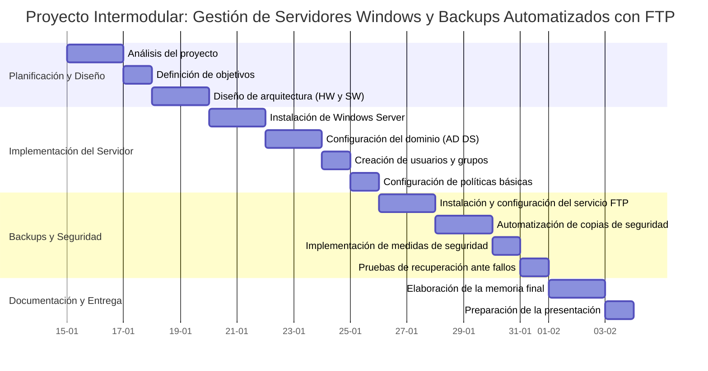

```mermaid
gantt
    title Proyecto Intermodular: Gestión de Servidores Windows y Backups Automatizados con FTP
    dateFormat  YYYY-MM-DD
    axisFormat  %d-%m

    section Planificación y Diseño
    Análisis del proyecto                     :a1, 2026-01-15, 2d
    Definición de objetivos                   :a2, 2026-01-17, 1d
    Diseño de arquitectura (HW y SW)          :a3, 2026-01-18, 2d

    section Implementación del Servidor
    Instalación de Windows Server             :a4, 2026-01-20, 2d
    Configuración del dominio (AD DS)         :a5, 2026-01-22, 2d
    Creación de usuarios y grupos             :a6, 2026-01-24, 1d
    Configuración de políticas básicas        :a7, 2026-01-25, 1d

    section Backups y Seguridad
    Instalación y configuración del servicio FTP :a8, 2026-01-26, 2d
    Automatización de copias de seguridad     :a9, 2026-01-28, 2d
    Implementación de medidas de seguridad    :a10, 2026-01-30, 1d
    Pruebas de recuperación ante fallos       :a11, 2026-01-31, 1d

    section Documentación y Entrega
    Elaboración de la memoria final           :a12, 2026-02-01, 2d
    Preparación de la presentación            :a13, 2026-02-03, 1d
```

